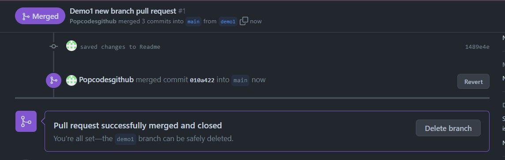

# Helen-Allen-Full-Stack

## A private repository for assignments and projects related to the Full stack stream - Helen Allen 

**I'm a scouser (originally from Liverpool), and I speak English and Italian!** :speech_balloon:

Currently studying on the Full Stack stream <sub>career switcher</sub> from project manager/teaching!
Although I studied another STEM subject at uni, Chemistry :boom:

My family is made up of: :smiling_face_with_three_hearts:
```
Me!
My Italian husband
Our daughter
The tabby cat, sushi  (see below for accurate representation of Sushi the cat)
```


##
# <p align="center"> Assignment 1</p>

<figure>
   <figcaption>Checking the status when no changes are detected</figcaption> 
   
</figure>
<figure>
   <figcaption>Checking the status an example with modifications made</figcaption> 
   
</figure>

<figure>
   <figcaption>Creating a branch AND adding files to a branch</figcaption> 
   
</figure>

<figure>
   <figcaption>Adding files to a branch</figcaption> 
   
</figure>

<figure>
    <figcaption>Adding commits with a meaningful message</figcaption>
    
</figure>

<figure>
    <figcaption>Opening and confirming a pull request</figcaption>
    
    
</figure>

<figure>
   <figcaption>Merging and deploying to main branch</figcaption> 
   
    
</figure>


+  .gitignore file specifies intentionally untracked files that Git should ignore when committing.
+ requirements.txt is a file that contains a list of packages or libraries needed to work on a project that can all be installed with the file.

##
# <p align="center"> Thank you!</p>
